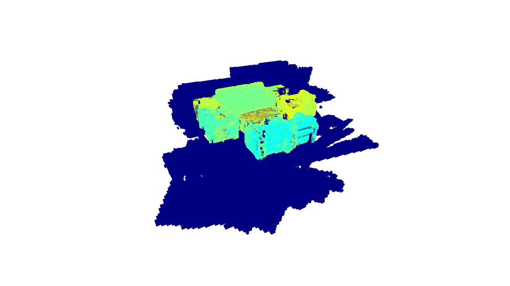

# Voxeland Uncertainty Map Visualizer

A Python tool to load any Voxeland-generated `.ply` file, color points by uncertainty, and display a voxelized 3D view. Press **S** during visualization to save a snapshot of the map and camera parameters.

---

## Description

This project provides a simple way to visualize uncertainty in a point cloud exported by Voxeland. The workflow is:

1. Load a `.ply` file containing uncertainty data.
4. Open an interactive window where you can explore the scene.
5. Press **S** to save a screenshot of the map and the camera position and rotation parameters.

---

## Requirements
Implemeted using Python 3.10+

Install dependencies with:
```bash
pip install -r requirements.txt
```

### Test demo


